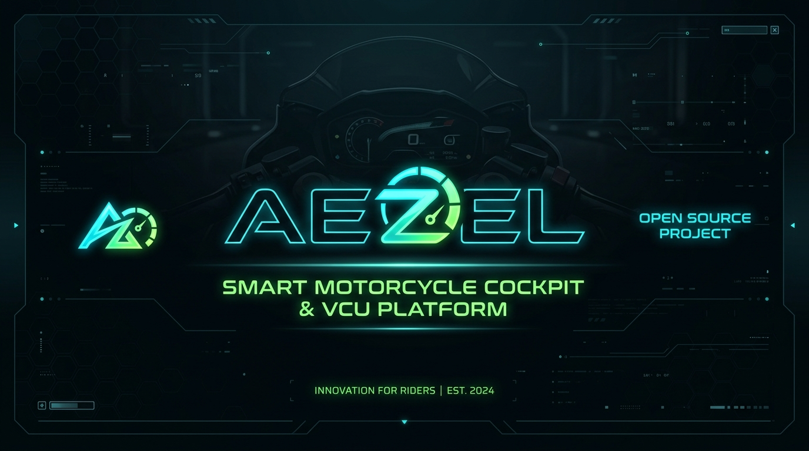
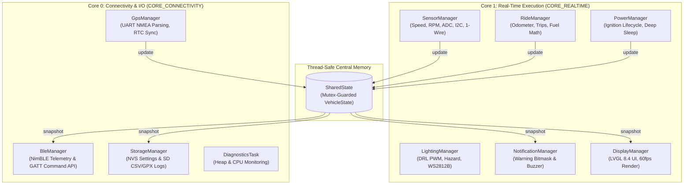

<div align="center">



# AEZEL — Open-Source ESP32-S3 Smart Motorcycle Platform

**Modular Vehicle Control Unit (VCU) • Real-Time Digital Dashboard • Ride Analytics • BLE Telemetry • Security**

[](LICENSE)
[](https://www.espressif.com/en/products/socs/esp32-s3)
[](platformio.ini)
[](https://lvgl.io)
[](diagram.json)

---

### *Open-source ESP32-S3 smart motorcycle platform with a modular VCU, digital dashboard, smartphone integration, ride analytics, OTA updates, and OEM-inspired architecture.*

</div>

---

## 📑 Table of Contents

- [Overview](#-overview)
- [Key Features](#-key-features)
- [System Architecture](#-system-architecture)
- [Quick Start & One-Command Setup](#-quick-start--one-command-setup)
- [Repository Layout](#-repository-layout)
- [Hardware Safety & Wiring](#-hardware-safety--wiring)
- [Documentation Index](#-documentation-index)
- [Safety Notice & Disclaimer](#-safety-notice--disclaimer)
- [Contributing & Governance](#-contributing--governance)
- [License](#-license)

---

## 🚀 Overview

**AEZEL** is an open-source smart motorcycle platform built around the ESP32-S3, designed to transform conventional motorcycles into connected, intelligent vehicles.

Instead of being just a digital display, AEZEL acts as a complete **Vehicle Control Unit (VCU)**, integrating real-time telemetry, ride analytics, smartphone connectivity, vehicle monitoring, security, diagnostics, and future expansion into a single modular ecosystem.

The project is designed with an **OEM-inspired software architecture**, allowing every subsystem—including the dashboard, sensors, lighting, storage, connectivity, security, and diagnostics—to operate independently while sharing a common, thread-safe vehicle state (`SharedState`). This modular approach makes the platform scalable, maintainable, and adaptable to a wide range of single-cylinder, multi-cylinder, carbureted, or FI motorcycles.

AEZEL aims to provide enthusiasts, makers, and developers with a professional-grade foundation for building modern motorcycle electronics without vendor lock-in, while remaining extensible for future technologies such as CAN bus integration, Android Auto/Apple CarPlay companion support, advanced navigation, cloud connectivity, and AI-assisted vehicle features.

---

## ✨ Key Features

| Category | Feature | Description |
| :--- | :--- | :--- |
| **Instrumentation** | Speedometer | Pulse-interval Hall timing + Exponential Moving Average (EMA) smoothing |
| | Tachometer | Coil-negative pickup counter with 60 FPS LVGL arc gauge (0–12,000 RPM) |
| | Gear Position | Calculated gear state (`N`, `1`–`5`) based on speed/RPM ratios & switches |
| **Telemetry & Sensors** | Environmental | Dual DS18B20 1-Wire sensors (Engine & Ambient temp) + BMP280 Altitude/Baro |
| | Dynamics / IMU | MPU6050 Accelerometer/Gyro for real-time lean angle, pitch & crash detection |
| | Electrical | Dual ADC monitoring for Battery Voltage & Charging-line health |
| | Fuel Analytics | Analog float sender ADC with self-calibrated range & consumption estimation |
| **Motorcycle Signals** | Discrete Inputs | Debounced opto-isolated reads for Indicators, High Beam, Horn, Side Stand, Front/Rear Brakes, Clutch, Kill Switch |
| **Navigation & Time** | GPS & RTC | NEO-6M/8M NMEA parsing, GPS speed cross-check, DS3231 RTC atomic sync |
| **UI & Experience** | LVGL 8.4 Dashboard | 60 FPS digital dashboard, customizable themes (`Modern`, `Sport`, `Neon`, `Retro`) |
| | Power Lifecycle | Ignition-triggered state machine (`Active` → `Linger` → `Safe Shutdown` → `Deep Sleep`) |
| **Connectivity & Security** | BLE Telemetry | 2 Hz JSON GATT telemetry service + Remote command API via NimBLE |
| | Warning Pipeline | 16-flag bitmask engine → prioritized alert banners & Piezo buzzer chimes |
| | Mass Storage | NVS settings persistence + SD card ride logging (CSV & GPX export) |

---

## 🏗️ System Architecture

AEZEL splits execution across the ESP32-S3's two Xtensa cores to guarantee that background storage or wireless communications never steal render cycles from the 60 FPS instrumentation display:



---

## ⚡ Quick Start & One-Command Setup

AEZEL includes an automated setup script that installs all build tools, compiles the firmware, and validates Wokwi hardware simulation in one step.

### 1. Clone & Setup
```bash
git clone https://github.com/ijlaal1610/AEZEL.git
cd AEZEL
./setup.sh
```

### 2. Available Commands
* **Build Firmware Binary**:
  ```bash
  ./setup.sh
  ```
* **Flash Connected ESP32 Hardware**:
  ```bash
  ./setup.sh --upload
  ```
* **Run Wokwi Hardware Simulation**:
  ```bash
  ./setup.sh --sim
  ```

---

## 📁 Repository Layout

```
AEZEL/
├── include/
│   ├── Config.h             # Pin mapping & hardware constants (single source of truth)
│   └── DataModel.h          # SharedState — mutex-guarded live vehicle state
├── src/
│   ├── main.cpp             # Boot sequence & FreeRTOS task graph initialization
│   └── managers/            # Modular subsystem managers
│       ├── BleManager.cpp   # Companion app GATT service & remote commands
│       ├── DisplayManager.cpp # LVGL 8.4 dashboard composition & 60fps render loop
│       ├── GpsManager.cpp   # NMEA GPS sentence parsing & RTC discipline
│       ├── LightingManager.cpp # Auto-DRL, hazard relay & WS2812B RGB accents
│       ├── NotificationManager.cpp # Warning pipeline & Piezo buzzer chimes
│       ├── PowerManager.cpp # Ignition lifecycle state machine & deep sleep
│       ├── RideManager.cpp  # Odometer, trip computer & consumption integration
│       ├── SensorManager.cpp # Speed, RPM, ADC, I2C IMU/Baro, 1-Wire acquisition
│       └── StorageManager.cpp # NVS flash settings & SD card GPX/CSV logging
├── docs/                    # Architectural specs, BOM, schematics, and guides
├── diagram.json             # Wokwi virtual testbench hardware schematic
├── wokwi.toml               # Wokwi simulation build target configuration
├── setup.sh                 # One-command installer & build script
└── platformio.ini           # PlatformIO build environment & dependencies
```

---

## 🔌 Hardware Safety & Wiring Notes

> [!CAUTION]
> **Read before wiring any motorcycle harness connections:**

- **Opto-Isolation**: Never connect 12V motorcycle harness lines directly to ESP32 GPIOs. Discrete inputs (indicators, brake switches, kill switch, ignition) must use opto-isolators or properly rated voltage dividers with Zener/TVS clamping.
- **Transients & Load-Dump**: Motorcycle electrical systems experience severe load-dump voltage spikes (>40V). Battery and charging sensing circuits must include TVS diodes across ADC inputs.
- **Power Supply**: The board must power off a dedicated automotive buck converter connected directly to battery-positive with reverse-polarity protection. Ignition is read as a logic signal only.
- **Coil Noise**: The RPM pickup line carries high-frequency ignition coil noise; a dedicated RC low-pass filter ahead of the opto-isolator is required to prevent erratic readings.

---

## 📚 Documentation Index

- 🛡️ [`docs/remote_control.md`](docs/remote_control.md) — Isolated RemoteControlManager safety interlocks & actuator safety rules
- 🏗️ [`docs/incremental_build.md`](docs/incremental_build.md) — Staged hardware build roadmap & peripheral probes
- 🛵 [`docs/vehicle_compatibility_avenger_jupiter.md`](docs/vehicle_compatibility_avenger_jupiter.md) — Vehicle compatibility matrix & harness wiring for Bajaj Avenger 150 (2015) & TVS Jupiter ZX (2017)
- 🌐 [`docs/ota_can_and_navigation.md`](docs/ota_can_and_navigation.md) — Over-The-Air Wi-Fi updates, Automotive CAN Bus (TWAI) & Turn-by-Turn Navigation
- 💰 [`docs/modular_budget_build.md`](docs/modular_budget_build.md) — Modular budget upgrade roadmap ($15–$55) & non-blocking peripheral probes
- 📱 [`docs/smartphone_remote_control.md`](docs/smartphone_remote_control.md) — BLE GATT remote control specification, JSON commands & app code
- 🔬 [`docs/features_deep_dive.md`](docs/features_deep_dive.md) — Low-level technical deep dive into every single feature & math formula
- ❓ [`docs/faq_and_qna.md`](docs/faq_and_qna.md) — Comprehensive technical Q&A reference & architectural decisions
- ⚡ [`docs/hardware_schematics_and_pinout.md`](docs/hardware_schematics_and_pinout.md) — Complete GPIO pinout table, voltage dividers & protection schematics
- 🧩 [`docs/subsystem_managers_guide.md`](docs/subsystem_managers_guide.md) — Architecture & execution breakdown for all 9 subsystem managers
- 📱 [`docs/ble_telemetry_protocol.md`](docs/ble_telemetry_protocol.md) — BLE GATT service UUIDs, 2 Hz JSON payload & Android/iOS code snippets
- 🔐 [`docs/data_model_and_thread_safety.md`](docs/data_model_and_thread_safety.md) — SharedState data model, FreeRTOS mutex rules & concurrency
- 🛠️ [`docs/developer_onboarding_and_toolchain.md`](docs/developer_onboarding_and_toolchain.md) — PlatformIO, Wokwi CLI, setup.sh & hardware flashing guide
- 🏍️ [`docs/motorcycle_harness_integration_guide.md`](docs/motorcycle_harness_integration_guide.md) — On-bike wiring, ignition coil tap & bench testing checklist
- ⭐ [`docs/features.md`](docs/features.md) — Comprehensive feature specification & boot animation details
- ⚡ [`docs/power_and_animations.md`](docs/power_and_animations.md) — Power architecture, ignition sensing & animation guide
- 📋 [`docs/bom.md`](docs/bom.md) — Complete Bill of Materials and recommended components
- ⚡ [`docs/power_distribution.md`](docs/power_distribution.md) — Power tree, buck regulation, and transient protection
- 🔌 [`docs/wiring.md`](docs/wiring.md) — Harness wiring diagrams, opto-coupler circuits, and routing
- 🎯 [`docs/calibration.md`](docs/calibration.md) — Wheel circumference, fuel sender curve, and IMU calibration
- 🧪 [`docs/testing_checklist.md`](docs/testing_checklist.md) — Bench testing and on-bike safety verification
- 🗺️ [`docs/roadmap.md`](docs/roadmap.md) — Subsystem expansion roadmap (CAN bus, navigation, companion app)
- 💾 [`docs/nvs_layout.md`](docs/nvs_layout.md) — NVS flash key-value schema

---

## ⚠️ Safety Notice & Disclaimer

> [!WARNING]
> **SAFETY NOTICE**: AEZEL is an experimental open-source platform. Any features that interact with a motorcycle's electrical or control systems must be thoroughly tested on a bench supply before on-road installation. The authors, maintainers, and contributors accept no responsibility or liability for property damage, personal injury, vehicle failure, or legal issues resulting from the use, modification, or deployment of this software or hardware.

---

## 👥 Contributing & Governance

Contributions to AEZEL are welcome! Whether you are implementing new subsystem managers, refining LVGL UI components, or improving sensor math:

- 📖 Read our [**Contributing Guide**](CONTRIBUTING.md) for pull request workflows.
- 📜 Adhere to the [**Code of Conduct**](CODE_OF_CONDUCT.md).
- 🛡️ Review our [**Security Policy**](SECURITY.md) to report vulnerabilities.
- 📝 Check the [**Changelog**](CHANGELOG.md) for version release details.

---

## 📜 License

AEZEL is licensed under the **[Apache License 2.0](LICENSE)**. 

```
Copyright 2026 AEZEL Contributors

Licensed under the Apache License, Version 2.0 (the "License");
you may not use this file except in compliance with the License.
You may obtain a copy of the License at

    http://www.apache.org/licenses/LICENSE-2.0

Unless required by applicable law or agreed to in writing, software
distributed under the License is distributed on an "AS IS" BASIS,
WITHOUT WARRANTIES OR CONDITIONS OF ANY KIND, either express or implied.
See the License for the specific language governing permissions and
limitations under the License.
```
